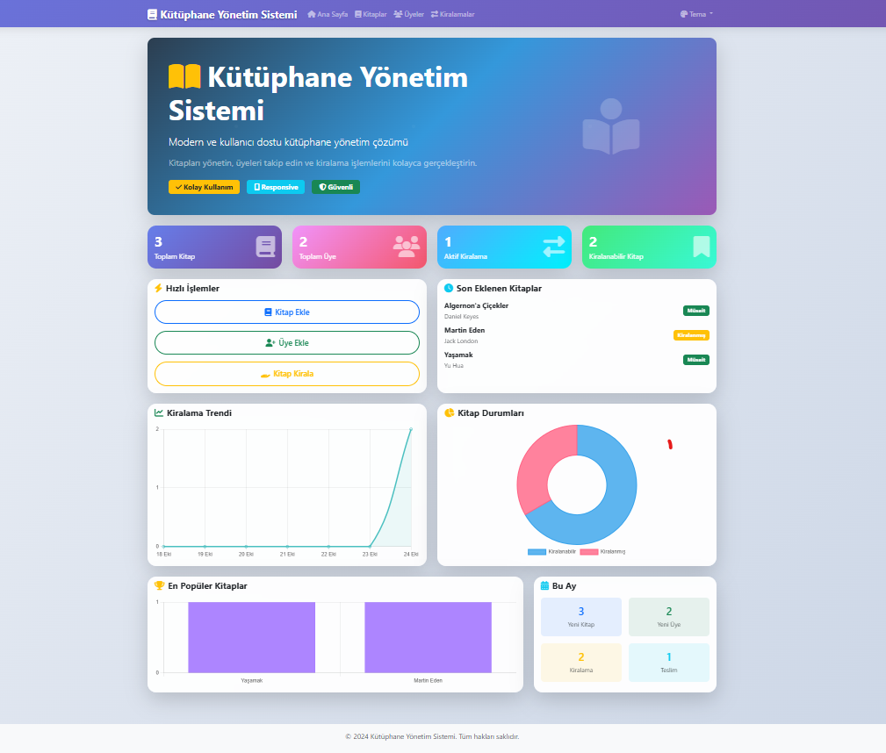
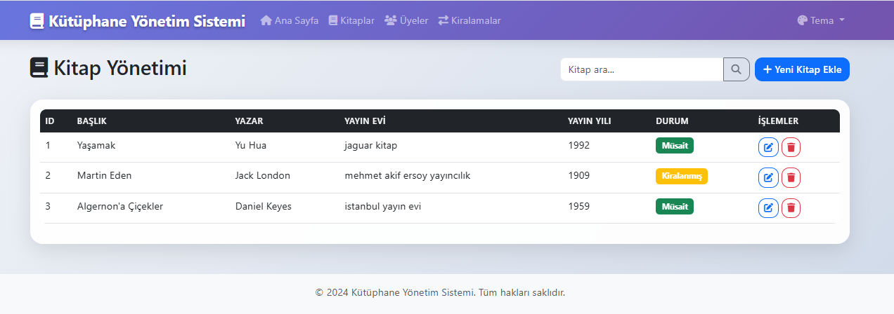
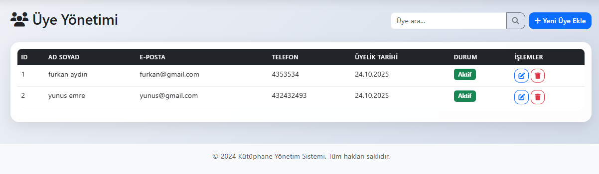
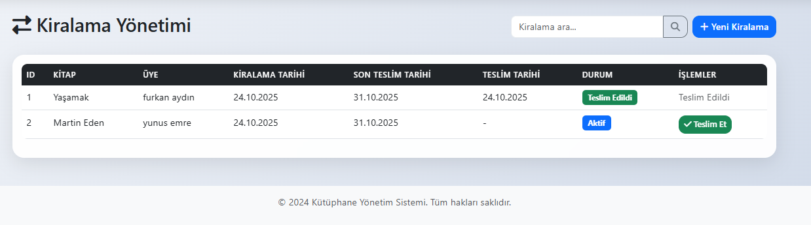

# 📚 Kütüphane Yönetim Sistemi

Modern, kullanıcı dostu ve verimli bir **kütüphane yönetim sistemi**.  
Kitapları yönetin, üyeleri takip edin ve kiralama işlemlerini kolayca gerçekleştirin.

---

## 🖼️ Proje Görselleri

### 🏠 Ana Sayfa


### 📖 Kitap Yönetimi Sayfası


### 👥 Üye Yönetimi Sayfası



### 🔄 Kiralama Sayfası


> Görseller `images/` klasöründe bulunmalıdır.  
> Örnek: `library/images/anaekran.png`

---

## ✨ Özellikler

### 📖 Kitap Yönetimi
- Kitap ekleme, düzenleme ve silme  
- Kitap bilgileri (başlık, yazar, yayınevi, ISBN vb.)  
- Kitap durum takibi (kiralanabilir / kiralanmış)

### 👥 Üye Yönetimi
- Üye ekleme, düzenleme ve silme  
- Üye bilgileri (ad, soyad, e-posta, telefon, adres)  
- Aktif / pasif üye durumu

### 🔄 Kiralama Sistemi
- Kitap kiralama ve teslim işlemleri  
- Kiralama geçmişi takibi  
- Otomatik kitap durum güncellemeleri

### 📊 Dashboard
- Genel istatistikler ve özet bilgiler  
- Son eklenen kitaplar  
- Hızlı erişim menüleri  

---

## 🚀 Kurulum

### Gereksinimler
- Python 3.8+
- pip (Python paket yöneticisi)

### Kurulum Adımları

1. **Projeyi klonlayın**
   ```bash
   git clone <repository-url>
   cd library
   ```

2. **Sanal ortam oluşturun (önerilir)**
   ```bash
   python -m venv venv
   # Windows
   venv\Scripts\activate
   # Linux/Mac
   source venv/bin/activate
   ```

3. **Bağımlılıkları yükleyin**
   ```bash
   pip install -r requirements.txt
   ```

4. **Uygulamayı başlatın**
   ```bash
   python main.py
   ```

5. **Tarayıcıda açın**
   ```
   http://localhost:8000
   ```

---

## 🎯 Kullanım

### Ana Sayfa
- İstatistikleri görüntüleyin  
- Hızlı işlem butonlarını kullanın  
- Son eklenen kitapları inceleyin  

### Kitap Yönetimi
1. "Kitaplar" sekmesine gidin  
2. "Yeni Kitap Ekle" butonuna tıklayın  
3. Kitap bilgilerini doldurun  
4. "Kaydet" butonuna tıklayın  

### Üye Yönetimi
1. "Üyeler" sekmesine gidin  
2. "Yeni Üye Ekle" butonuna tıklayın  
3. Üye bilgilerini doldurun  
4. "Kaydet" butonuna tıklayın  

### Kiralama İşlemleri
1. "Kiralamalar" sekmesine gidin  
2. "Yeni Kiralama" butonuna tıklayın  
3. Kitap ve üyeyi seçin  
4. Teslim tarihini belirleyin  
5. "Kirala" butonuna tıklayın  

---

## 🛠️ Kullanılan Teknolojiler

### Backend
- **FastAPI** – Modern, yüksek performanslı web framework  
- **SQLAlchemy** – ORM (Object-Relational Mapping)  
- **SQLite** – Hafif ve taşınabilir veritabanı  
- **Pydantic** – Veri doğrulama ve tip kontrolü  

### Frontend
- **HTML5** – Semantik yapı  
- **CSS3** – Modern tasarım  
- **Bootstrap 5** – Responsive framework  
- **JavaScript (ES6+)** – Dinamik etkileşim  
- **Axios** – HTTP istemcisi  

---

## 📁 Proje Yapısı

```
library/
├── main.py              # Ana uygulama dosyası
├── models.py            # Veritabanı modelleri
├── schemas.py           # Pydantic şemaları
├── database.py          # Veritabanı bağlantısı
├── requirements.txt     # Python bağımlılıkları
├── README.md            # Proje dokümantasyonu
├── templates/           # HTML şablonları
│   ├── base.html
│   ├── index.html
│   ├── kitaplar.html
│   ├── uyeler.html
│   └── kiralamalar.html
├── static/              # Statik dosyalar
│   ├── css/
│   │   └── style.css
│   └── js/
│       └── app.js
└── images/              # Görseller
    ├── home.png
    ├── books.png
    ├── members.png
    └── rentals.png
```

---

## 🔧 API Uç Noktaları

| Metod | URL | Açıklama |
|-------|-----|-----------|
| `GET` | `/api/kitaplar` | Tüm kitapları listele |
| `GET` | `/api/kitaplar/{id}` | Belirli kitabı getir |
| `POST` | `/api/kitaplar` | Yeni kitap ekle |
| `PUT` | `/api/kitaplar/{id}` | Kitabı güncelle |
| `DELETE` | `/api/kitaplar/{id}` | Kitabı sil |
| `GET` | `/api/uyeler` | Tüm üyeleri listele |
| `POST` | `/api/uyeler` | Yeni üye ekle |
| `PUT` | `/api/uyeler/{id}` | Üyeyi güncelle |
| `DELETE` | `/api/uyeler/{id}` | Üyeyi sil |
| `GET` | `/api/kiralamalar` | Tüm kiralamaları listele |
| `POST` | `/api/kiralamalar` | Yeni kiralama oluştur |
| `PUT` | `/api/kiralamalar/{id}/teslim` | Kitap teslim et |

---

## 🐛 Sorun Giderme

| Sorun | Çözüm |
|--------|--------|
| **Port 8000 kullanımda** | `uvicorn main:app --port 8001` komutunu kullanın |
| **Veritabanı hatası** | `kutuphane.db` dosyasını silip `python main.py` komutuyla yeniden oluşturun |
| **Paket yükleme hatası** | `python -m pip install --upgrade pip && pip install -r requirements.txt` |

---

## 📝 Lisans
Bu proje **MIT Lisansı** altında lisanslanmıştır.

---

## 🤝 Katkıda Bulunma
1. Projeyi fork edin  
2. Yeni bir branch oluşturun (`git checkout -b feature/YeniOzellik`)  
3. Değişikliklerinizi commit edin (`git commit -m "Yeni özellik eklendi"`)  
4. Branch’i push edin (`git push origin feature/YeniOzellik`)  
5. Pull Request gönderin  

---

## 📞 İletişim
Sorularınız veya önerileriniz için issue açabilir veya doğrudan iletişime geçebilirsiniz.

---

⭐ **Projeyi beğendiyseniz yıldız vermeyi unutmayın!**
